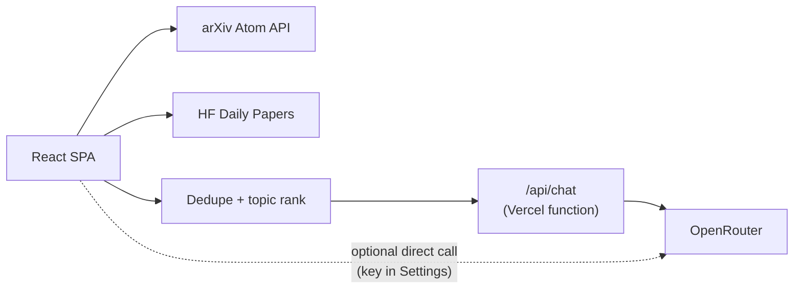

# PaperPulse

> AI research briefings for fast paper triage — fetch, rank, and summarize arXiv and Hugging Face Daily papers, then chat with any one of them.

Pick topic presets (LLMs, AI Agents, Diffusion, …) or type a custom subject, hit
**Analyze**, and PaperPulse pulls fresh papers, deduplicates and topic-ranks
them, and generates a structured briefing for each: TL;DR, key points, method,
results, impact score, and tags. Open any paper's chat to ask questions answered
from its full text, with citations.

## Stack

| Concern | Technology |
|---|---|
| Frontend | React 18, Vite 6 — no CSS framework, styles inlined as a JS template literal |
| AI | [OpenRouter](https://openrouter.ai) — any supported model |
| Paper sources | arXiv Atom API, Hugging Face Daily Papers JSON API |
| Full text | `arxiv.org/html/{id}` → `ar5iv` fallback, via CORS proxies |
| Deployment | Vercel — static site + Node serverless function |

## Quick start

Requires Node ≥ 18 and an [OpenRouter API key](https://openrouter.ai/keys).

```bash
npm install
cp .env.example .env.local     # add your API key and a random server access token
npm run dev
```

Open the URL Vite prints, usually <http://localhost:5173>.

`npm run dev` mounts the same `/api/chat` handler Vercel uses and loads
server-only values from `.env.local`. Alternatively, paste an OpenRouter key
into the app's **Settings** panel — the browser then calls OpenRouter directly,
bypassing the server route. Server-routed requests require the private access
token in Settings. Both credentials stay in tab memory and are cleared on reload;
keys saved in localStorage by earlier versions are removed automatically.

> **Never prefix the secret key with `VITE_`.** Vite bundles every `VITE_*`
> variable into the browser bundle. Only `VITE_OPENROUTER_MODEL` — a non-secret
> model id — is safe to expose that way.

## Commands

| Command | Does |
|---|---|
| `npm run dev` | Vite dev server (foreground) with the `/api/chat` handler |
| `npm run build` | Production build to `dist/` |
| `npm run preview` | Preview the built bundle |
| `make install` | `npm install` |
| `make run` / `make stop` / `make restart` | Run detached (PID in `.vite.pid`, logs in `.vite.log`) |
| `make status` / `make logs` | Process state / dev server logs |
| `make build` | Production build |

Override the port with `make run PORT=3000`.

## Features

| Feature | Details |
|---|---|
| **Topic presets** | 14 presets (LLMs, AI Agents, Reasoning, RAG, RLHF/Alignment, Multimodal, CV, Diffusion, Mech Interp, Efficiency/MoE, Robotics/VLA, AI Safety, Benchmarks, ML) backed by arXiv category codes and keyword lists |
| **Custom topics** | Free-text input; related preset terms are expanded before the arXiv query is built |
| **HF Daily source** | Toggle Hugging Face Daily Papers (community-upvoted) alongside arXiv |
| **Paper count** | 10, 20, or 30 per run |
| **Structured briefings** | TL;DR, 4 key points, method, results, impact (1–5 stars), tags, "why it matters" |
| **Impact filter** | Show only impact ≥ 3, ≥ 4, or exactly 5 |
| **Tag filter** | Click any generated tag to filter the digest |
| **Subject finder** | Re-ranks loaded papers in real time without a new API call |
| **Free-text filter** | Across title, authors, abstract, TL;DR, method, results, tags |
| **Paper chat** | RAG-style chat grounded in full paper text, evidence cited with `[E1]` ids |
| **Bookmarks** | Star papers into a Saved tab, persisted in `localStorage` |
| **Markdown export** | Copy or download the digest |
| **Dark mode** | Persisted across sessions |
| **Result caching** | Last digest restored on reload, so you never start blank |

### Keyboard shortcuts

| Key | Action |
|---|---|
| `Escape` | Close the paper chat modal |
| `Enter` (topic input) | Start a new Analyze run |

## Project structure

```
api/
  chat.js               # Vercel serverless function — proxies OpenRouter
src/
  App.jsx               # ★ the entire app: fetching, ranking, UI, chat (~3k lines)
  main.jsx              # React entry point
public/                 # favicon.svg, PWA icons, site.webmanifest
arxiv-batch-analyzer.jsx  # legacy 3-line re-export shim → src/App.jsx
index.html
vite.config.js
vercel.json             # build config + serverless function + SPA rewrite
```

`src/App.jsx` is a deliberate single-file app — data fetching, ranking, every
component, and the chat system live in one ~3,000-line module. Know that before
planning a change. The root `arxiv-batch-analyzer.jsx` is a compatibility shim
for older imports and nothing references it.

## Architecture



The serverless function exists so the API key stays server-side. The direct
browser path is opt-in and only used when you paste a key into Settings.

### How paper chat works

1. Fetch the full HTML render from `arxiv.org/html/{id}`, falling back to
   `ar5iv`, via CORS proxies (direct → `corsproxy.io` → `api.allorigins.win`).
   If all fail, chat degrades to the abstract plus the generated briefing.
2. Split the text into structured sections (Abstract, Introduction, Method,
   Results, …) then into overlapping ~1,700-character chunks.
3. For each message, select the top 7 chunks by a BM25-style token score with
   intent boosting — a question about "limitations" boosts limitation and
   discussion sections.
4. Send those chunks plus up to 12 recent turns to the LLM, with a system prompt
   requiring `[E1]`-style evidence citations and an explicit "the evidence
   doesn't support this" escape hatch.
5. Persist chat history per paper in `localStorage`.

### Ranking

`scorePaperForTopic` weights: arXiv category match (+8 each), phrase match in
title (+18) and abstract (+8), token match in title (+5) and abstract (+2), plus
recency, HF upvotes, and quality signals ("state of the art", "benchmark", …).

## Configuration

| Variable | Required | Purpose |
|---|---|---|
| `OPENROUTER_API_KEY` | Yes (server) | OpenRouter secret key — used only in `api/chat.js` |
| `PAPERPULSE_ACCESS_TOKEN` | Yes (server) | Private access token, at least 32 characters; generate with `openssl rand -hex 32`. Without it, server chat is disabled. Never expose it with a `VITE_` prefix. |
| `OPENROUTER_MODEL` | No | Server-side model for `/api/chat`. The client model is ignored for server-routed requests. |
| `VITE_OPENROUTER_MODEL` | No | Browser default shown in the Settings panel |

Both model variables fall back to `deepseek/deepseek-v4-pro` in code.

### localStorage keys

`pb_cache` (last digest) · `pb_bookmarks` · `pb_paper_chats`. Clear them in
DevTools → Application → Local Storage for a clean state.

## Deploy on Vercel

1. Push to GitHub and [import the project](https://vercel.com/new).
2. Under **Project Settings → Environment Variables**, add `OPENROUTER_API_KEY`
   and a randomly generated `PAPERPULSE_ACCESS_TOKEN`
   (and optionally `OPENROUTER_MODEL`, `VITE_OPENROUTER_MODEL`).
3. Deploy. Enter the private access token in Settings to use server-funded chat.
   Public visitors can enter their own OpenRouter API key instead.

`vercel.json` handles the rest: `npm run build` → `dist`, `api/chat.js` as a
serverless function with a 30-second max duration, and an SPA rewrite sending
all non-API routes to `index.html`.

## Privacy and deployment security

Chat messages, paper excerpts, and analysis prompts are sent to OpenRouter and
its selected model provider. Paper-fetch fallback services (`corsproxy.io` and
`api.allorigins.win`) receive requested URLs, which can include research queries.
Bookmarks, digests, and paper chats persist in browser localStorage; clear site
data to remove them. Credentials are held only in tab memory.

The server access token is intended for a small, trusted group. Do not publish
it or embed it in the frontend. Authentication does not impose usage quotas:
configure provider spending limits and deployment-level rate limiting before
sharing server-funded access widely.

Older revisions supported API keys in frontend environment variables. If those
revisions were deployed with real keys, revoke those keys and remove old
accessible deployments. Updating this source cannot clean existing bundles.

## License

Private project — see `package.json`.
